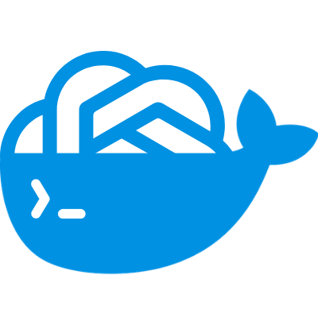

<p align="center">
  
</p>

<h1 align="center">Codex Telegram Bridge</h1>

<p align="center">
Official Codex CLI in Docker, controlled from Telegram.
</p>

<p align="center">
  
  
  
</p>

## What it is

This project runs the official `@openai/codex` CLI inside Docker and exposes it through a Telegram bot.

The bridge only:

- receives Telegram messages
- runs `codex exec`
- sends the result back to Telegram

It supports:

- per-chat login with official device auth
- persistent chat sessions with `/new`
- image input from Telegram photos and image documents
- audio input from Telegram voice notes and audio files
- audio replies for voice-driven chats
- language-aware voice defaults through `VOICE_LOCALE`
- live progress updates in a single Telegram message while Codex works
- host workspace access
- full host shell access when `HOST_SHELL_MODE=host`
- host Docker access
- automatic Codex updates

## Quick start

1. Create a Telegram bot with BotFather.
2. Get your Telegram `chat_id`.
3. Copy the config template:

```bash
cd /home/ubuntu/docker/codex-telegram
cp .env.example .env
```

4. Fill the minimum config:

```env
TELEGRAM_BOT_TOKEN=your_bot_token
TELEGRAM_ALLOWED_CHAT_IDS=your_chat_id
CODEX_AUTH_MODE=per_chat
CODEX_AUTH_ROOT=/data/auth
HOST_WORKSPACE=/home/ubuntu
HOST_SHELL_MODE=host
CODEX_CHANNEL=latest
VOICE_LOCALE=en_US
```

5. Start it:

```bash
docker compose up -d --build
```

6. In Telegram, run:

```text
/login
```

Complete the OpenAI device-auth flow in your browser.

7. Send a task:

```text
list all running docker containers on this machine
```

## Commands

| Command | Purpose |
| --- | --- |
| any plain message | Run the prompt through Codex |
| voice note or audio file | Transcribe the audio and run it as the prompt |
| photo or image document | Send the image to Codex, using the caption as the prompt when present |
| `/run <prompt>` | Run a task explicitly |
| `/login` | Start official Codex login for this chat |
| `/login status` | Show login state |
| `/login cancel` | Cancel a pending login |
| `/logout` | Remove stored credentials for this chat |
| `/new` | Start a fresh Codex conversation |
| `/stop` | Stop the currently running Codex task |
| `/limits` | Show the latest Codex quota state for this chat |
| `/status` | Show bridge status |
| `/cron` | View and manage scheduled tasks |
| `/version` | Show installed Codex CLI version |
| `/update` | Force a Codex update check |
| `/help` | Show quick help |

## Auth modes

### `per_chat` recommended

Each Telegram chat gets its own Codex profile under `/data/auth/<chat_id>/home/.codex`.

Use this for public or multi-user deployments.

### `shared`

All chats reuse the same Codex profile.

Use this only for a private single-operator setup.

## Important config

| Variable | Meaning |
| --- | --- |
| `TELEGRAM_BOT_TOKEN` | Telegram bot token |
| `TELEGRAM_ALLOWED_CHAT_IDS` | Comma-separated allowlist of allowed chats |
| `CODEX_AUTH_MODE` | `per_chat` or `shared` |
| `CODEX_AUTH_ROOT` | Root directory for per-chat auth |
| `CODEX_CONFIG_DIR` | Shared Codex profile path |
| `HOST_WORKSPACE` | Workspace path exposed inside the container |
| `HOST_SHELL_MODE` | `host` to execute generated shell commands against the real host |
| `CODEX_CHANNEL` | npm channel or exact version |
| `CODEX_MODEL` | Optional model override |
| `CODEX_EXTRA_ARGS` | Extra flags passed to `codex exec` |
| `VOICE_LOCALE` | Default locale for voice input/output, for example `en_US`, `es_ES`, `fr_FR` |
| `STT_MODEL` | Faster-Whisper model name for audio transcription |
| `STT_LANGUAGE` | Optional transcription language hint. Leave it empty to derive it from `VOICE_LOCALE` |
| `TTS_ENGINE` | Voice engine. `piper` is the recommended default |
| `TTS_PIPER_VOICE` | Optional explicit Piper voice. Leave it empty to auto-pick from `VOICE_LOCALE` |
| `TTS_VOICE` | `espeak-ng` fallback voice used only if Piper fails |

## Voice locales

You can keep voice setup simple by setting only `VOICE_LOCALE`.

Built-in presets:

| Locale | Auto-selected Piper voice |
| --- | --- |
| `en_US` | `en_US-lessac-high` |
| `en_GB` | `en_GB-cori-high` |
| `es_ES` | `es_ES-sharvard-medium` |
| `es_MX` | `es_MX-claude-high` |
| `es_AR` | `es_AR-daniela-high` |
| `fr_FR` | `fr_FR-siwis-medium` |
| `de_DE` | `de_DE-thorsten-high` |
| `it_IT` | `it_IT-paola-medium` |
| `pt_BR` | `pt_BR-faber-medium` |
| `pt_PT` | `pt_PT-tugão-medium` |

Examples:

```env
VOICE_LOCALE=en_US
```

```env
VOICE_LOCALE=es_ES
```

```env
VOICE_LOCALE=fr_FR
```

If you want a specific Piper voice instead of the preset, set `TTS_PIPER_VOICE` directly.

## Sessions

The bridge keeps one active Codex thread per Telegram chat.

- normal messages continue the current conversation
- `/new` starts a fresh one

## Cron jobs

You can schedule prompts to run automatically from Telegram.

Examples:

```text
/cron
```

```text
/cron add docker-check | */30 * * * * | list all running docker containers
```

```text
/cron pause <id>
/cron resume <id>
/cron delete <id>
/cron run <id>
```

Cron jobs are stored per chat and run using that chat's current login, model, and thinking settings.

## Updating

The bridge checks the configured npm channel and updates Codex automatically when needed.

You can also force it manually:

```text
/update
```

## Security

This bot can be very powerful depending on what you mount.

Be careful with:

- `TELEGRAM_ALLOWED_CHAT_IDS`
- `HOST_SHELL_MODE=host`
- `/var/run/docker.sock`
- shared Codex profiles
- aggressive `CODEX_EXTRA_ARGS`

For public use, prefer:

- `CODEX_AUTH_MODE=per_chat`
- a strict allowlist
- exact version pinning when stability matters

## Files

- `docker-compose.yml` - service definition
- `.env.example` - config template
- `services/bridge/Dockerfile` - runtime image
- `services/bridge/app.py` - Telegram bridge
- `services/bridge/entrypoint.sh` - container startup
- `assets/logo.png` - branding asset

## Troubleshooting

### Bot does not answer

Check:

```bash
docker compose logs -f
```

Then confirm:

- the bot token is correct
- the chat id is allowlisted
- the container is running

### Bot asks for login

Run:

```text
/login
```

### Tasks fail

Check:

- Codex login completed successfully
- the workspace mount is correct
- Docker socket access exists if your task needs Docker
- your `CODEX_EXTRA_ARGS` make sense for the environment
